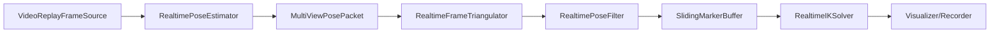
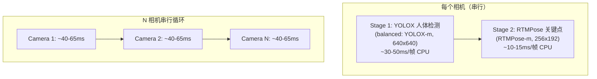

# Pose2Sim Realtime 管线审查与 2D 瓶颈优化方案

---

## 一、管线架构审查

### 1.1 整体结构评价

当前管线的数据流设计是**合理的**，与方案讨论文档的共识一致：




**优点：**

- 模块化清晰：每个 `.py` 职责单一（capture / pose2d / triangulate / filter / buffer / IK / viz / recorder）
- 数据包 (`packets.py`) 用 frozen dataclass 定义，类型安全
- Protocol 接口设计（`FrameSource`, `FrameTriangulator`, `RealtimePoseFilter`）便于替换实现
- 从 Config.toml 复用现有离线配置，不破坏原管线
- 计时度量 (`last_step_metrics`) 内建，方便性能分析

**主要问题：**

- **整个管线是单线程串行的**——这是性能瓶颈的根本原因
- 2D 推理对多相机是逐相机串行循环，没有任何并行
- `infer_batch` 是假的批处理，实际只是 `[self.infer(p) for p in packets]`
- 没有管线并行（不能在做当前帧三角化时同时做下一帧 2D）

### 1.2 可读性评价

整体可读性 **中等偏上**，但有以下问题：


| 问题                        | 位置                                  | 建议                                  |
| ------------------------- | ----------------------------------- | ----------------------------------- |
| `value == value` 判断 NaN   | `run_file_replay.py:156`            | 改用 `math.isnan()` 或 `np.isfinite()` |
| `__import__("toml")` 动态导入 | `triangulate_frame.py:63`           | 改为 `import toml`                    |
| filterpy 在方法体内导入          | `filter_realtime.py:40-41`          | 移到模块顶部                              |
| 硬编码绝对路径                   | `test_api_visualizer.py`            | 改为相对路径或配置                           |
| `__all__` 不完整             | `__init__.py`                       | 补充 `RealtimeFrameTriangulator` 等    |
| 中文注释混杂英文                  | `test_opensim_window_visualizer.py` | 统一为英文                               |
| Recorder 缺少 `start()` 方法  | `recorder.py`                       | 添加空实现保持接口统一                         |


---

## 二、2D 速度瓶颈深度分析

### 2.1 瓶颈定位

RTMLib PoseTracker 的 **两阶段推理** 是关键瓶颈：




**以 4 相机为例，当前架构的 2D 延迟估算：**

- balanced 模式：4 x (30-50ms 检测 + 10-15ms 姿态) = **160-260ms/帧**
- 即便 `det_frequency=4`（每 4 帧检测一次），平均 2D 耗时仍约 **80-120ms/帧**
- 这意味着仅 2D 就只能跑 **8-12 FPS**，远达不到 30fps 实时

### 2.2 根因分析

1. **多相机串行推理**：`[pose2d.py:157-158](Pose2Sim/realtime/pose2d.py)` `infer_batch` 只是一个 for 循环
2. **检测模型过重**：balanced 模式用 YOLOX-m（640x640 输入），单人场景完全没必要
3. **每个相机独立 PoseTracker**：N 个独立 ONNX session，无法共享 GPU batch
4. **没有管线并行**：Pipeline 的 `run_step` 完全串行，不能 overlap 不同阶段

### 2.3 实时化可行性判断

**结论：30fps 实时完全可行，但需要以下改造。**

优化后各阶段耗时估算（4 相机，CPU，使用 lightweight 模式 + 并行）：


| 阶段      | 当前耗时           | 优化后耗时        | 改造方式                                |
| ------- | -------------- | ------------ | ----------------------------------- |
| 2D（4相机） | 160-260ms      | **15-25ms**  | 并行 + lightweight + 提高 det_frequency |
| 三角化     | 5-15ms         | 5-15ms       | 已经很快                                |
| 滤波      | < 1ms          | < 1ms        | 已经很快                                |
| IK（窗口）  | 10-30ms        | 10-30ms      | simple model 下已可接受                  |
| **总计**  | **~200-300ms** | **~30-70ms** | **14-33 FPS**                       |


如有 GPU (CUDA)，2D 进一步降到 5-10ms，整体可达 30+ FPS。

---

## 三、具体优化方案

### 优化 1：多相机并行 2D 推理（核心改造）

将 `[pose2d.py](Pose2Sim/realtime/pose2d.py)` 的 `infer_batch` 改为 `ThreadPoolExecutor` 并行。

由于每个相机已有独立 PoseTracker 实例，线程安全。ONNX Runtime 在多线程下可以并行推理（尤其 CPU 后端）。改造后 N 相机延迟从 `N * T` 降为 `~T`（线性加速）。

```python
from concurrent.futures import ThreadPoolExecutor

class RealtimePoseEstimator:
    def __init__(self, ...):
        ...
        self._thread_pool = ThreadPoolExecutor(max_workers=len(camera_ids))

    def infer_batch(self, frame_packets):
        futures = [self._thread_pool.submit(self.infer, pkt) for pkt in frame_packets]
        return [f.result() for f in futures]
```

### 优化 2：使用 lightweight 模式

在 `[config.py](Pose2Sim/realtime/config.py)` 中为 realtime 独立提供 mode 配置，默认 `lightweight`（YOLOX-tiny 416x416 + RTMPose-s 256x192）。

对比：

- balanced (YOLOX-m): 检测 ~30-50ms
- **lightweight (YOLOX-tiny): 检测 ~8-15ms**——快 3-4 倍

### 优化 3：提高 det_frequency

对于单人实时场景，检测频率可以大幅降低。在 realtime 配置中设置：

- `det_frequency = 10`（甚至 20-30）
- 含义：每 10 帧做一次完整检测，其余帧只跑 RTMPose 关键点估计
- 单人场景下 bounding box 变化缓慢，完全可以

### 优化 4：可选 RTMO 单阶段模型

RTMO 将检测和姿态估计合并为一个网络，消除两阶段开销。但需要 `pose_model = 'Body'` (COCO_17)，marker 数量会减少。作为可选高级优化。

### 优化 5：管线级并行（阶段 3）

按方案讨论文档的阶段 3 设计，将管线拆为生产者-消费者线程：

- Thread A: 采集 + 2D 推理 → frame_queue
- Thread B: 三角化 + 滤波 → marker_buffer
- Thread C: IK + 可视化

但这是第二优先级——先做优化 1-3 已经可以达到实时。

---

## 四、代码改造清单

### 4.1 核心性能改造

1. `**pose2d.py`**：`infer_batch` 改为 ThreadPoolExecutor 并行，添加 `shutdown` 方法
2. `**pose2d.py`**：新增 `realtime_mode` / `realtime_det_frequency` 参数覆盖，实时默认 lightweight + det_frequency=10
3. `**pipeline.py`**：`_infer_2d` 确保调用 `infer_batch`（已经是了，但要确保线程池版本生效）
4. `**config.py`**：新增 `[realtime.pose]` 配置段，支持独立的 `mode`, `det_frequency` 覆盖
5. `**Config.toml`**：添加 `[realtime.pose]` 默认配置示例

### 4.2 可读性修复

1. `**run_file_replay.py:156**`：`value == value` 改为 `not math.isnan(value)`
2. `**triangulate_frame.py:63**`：`__import__("toml")` 改为 `import toml`
3. `**filter_realtime.py**`：filterpy 导入移到模块顶部
4. `**recorder.py**`：添加空 `start()` 方法
5. `**__init__.py**`：补全 `__all`__

