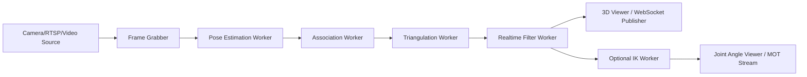

# Pose2Sim 在线可视化改造分析与实施方案

## 1. 结论先说

可以基于你给的 `Pose2Sim_Realtime_Analysis.md` 继续推进，但不能直接把它当成“已经验证过的实施设计”。

原因很直接：

1. 那份文档对总体方向判断基本对。
2. 但它把一部分“算法上可逐帧”混同成了“当前代码里已经适合实时”。
3. 你现在真正要解决的，不只是离线可视化换成在线可视化，而是把当前的“阶段式批处理 + 文件中转”改成“流式处理 + 内存中转 + 实时输出”。
4. 如果你的目标只是“在线看到 2D/3D 骨架”，难度中等，可以分阶段做。
5. 如果你的目标是“在线看到 OpenSim 关节角或肌骨模型”，难度会明显更高，瓶颈主要在 IK 和整体架构，而不在可视化本身。

我的判断是：

- `在线 2D 可视化`：可行，改造难度低。
- `在线 3D 关键点可视化`：可行，改造难度中等。
- `在线 OpenSim 骨架 / 关节角可视化`：可行，但属于高难度重构，不建议作为第一阶段目标。

## 2. 对原分析文档的评价

### 2.1 可以保留的判断

原文档以下判断基本成立：

- 标定不是实时瓶颈。
- 2D pose estimation 本质上是逐帧的。
- `personAssociation` 和 `triangulation` 的核心算法可以逐帧执行。
- `InverseKinematicsTool` 的离线调用方式确实是当前最大的结构性障碍之一。
- 当前项目本身就把“逐帧实时运行”列在 roadmap 里，说明方向是顺着项目本身设计演进走的。

对应证据：

- 当前流水线是分阶段顺序执行，而不是常驻流式管线：`Pose2Sim/Pose2Sim.py`
- README 明确写了未完成项：`Real-time: Run Pose estimation, Person association, Triangulation, Kalman filter, IK frame by frame`：`README.md`

### 2.2 需要修正的地方

#### 修正 1：当前并不是“已经实时，只差切换输入源”

`poseEstimation.py` 虽然逐帧调用 `pose_tracker(frame)`，但当前入口仍是读取视频文件、写 JSON、可选显示结果，不是在线流式服务。

证据：

- `cv2.VideoCapture(video_path)`：`Pose2Sim/poseEstimation.py`
- 每帧写 OpenPose 格式 JSON：`Pose2Sim/poseEstimation.py`

所以它不是不能实时，而是“推理核心可实时，工程结构仍偏离线”。

#### 修正 2：`OneEuro` 当前实现不是严格实时版本

原文档把 OneEuro 归为天然实时滤波器，这个结论对“算法概念”成立，但对“仓库当前实现”不成立。

当前实现写的是 `Zero-phase OneEuro filter`，并且明确做了 forward/backward 两次滤波：

- `filtered_forward = apply_filter(data)`
- `filtered_backward = apply_filter(filtered_forward[::-1])[::-1]`

证据：

- `Pose2Sim/filtering.py`

这意味着仓库里的 `one_euro_filter_1d` 不能直接拿来做严格在线滤波。  
如果要实时，你要么：

- 改成单向 OneEuro；
- 要么用现成的 `Kalman(smooth=False)` 路线。

#### 修正 3：`markerAugmentation` 当前不是逐帧模型

原文档说 LSTM 可以逐帧适配，这个方向不能说错，但当前代码实现不是逐帧 hidden-state 流式推理。

当前代码做的是：

1. 先把整段 TRC 序列读进来；
2. 把整段序列 reshape 成 `(1, T, F)`；
3. 一次性送进 ONNX 模型；
4. 再把整段输出写回新的 TRC。

证据：

- `inputs = np.reshape(inputs, (1, inputs.shape[0], inputs.shape[1]))`
- `session.run(['output_0'], {'inputs': inputs.astype(np.float32)})`

文件：

- `Pose2Sim/markerAugmentation.py`

这说明它当前更像“序列到序列”的批处理增强，不是已经具备 hidden-state 连续在线推理的实现。

#### 修正 4：当前最大的工程障碍，其实是“文件中转 + 阶段式架构”

原文档把主要难点集中在 IK，这不完整。

实际看代码后，更大的系统级问题是：

1. `poseEstimation` 每帧落 JSON；
2. `personAssociation` 逐帧从 JSON 读回，再改写 JSON；
3. `triangulation` 再从 JSON 逐帧读回，最后再聚合成 DataFrame 和 `.trc`；
4. `filtering` 再从 `.trc` 开始；
5. `kinematics` 再从 `.trc` 驱动 OpenSim。

这是一条典型的离线批处理链路，不是在线可视化链路。

#### 修正 5：你要先定义“在线可视化”到底是哪一级

这个问题非常关键。当前仓库已有的“可视化”基本都是下面这些：

- 2D 检测窗口显示：`Pose2Sim/poseEstimation.py`
- 离线叠加 JSON 到图像：`Pose2Sim/Utilities/json_display_with_img.py`
- 离线绘制 TRC 曲线：`Pose2Sim/Utilities/trc_plot.py`
- OpenSim GUI / Blender 可视化：README 说明

这几个都不是你想要的“在线可视化系统”。

你至少要先明确目标属于哪一层：

### Level A：在线显示 2D 检测结果

就是多路相机画面上实时叠加 2D skeleton。

### Level B：在线显示 3D 重建骨架

就是每帧 triangulation 完立即在 3D viewer 里更新关键点和骨架连线。

### Level C：在线显示 OpenSim 结果

就是实时输出 joint angles，或者驱动一个 OpenSim / 自定义 avatar 实时动起来。

这三层难度完全不同，不应该混成一个任务。

## 3. 仓库现状的真实结构

当前代码本质上是离线批处理管线：

```text
Calibration
  -> Pose Estimation
  -> Synchronization
  -> Person Association
  -> Triangulation
  -> Filtering
  -> Marker Augmentation
  -> Kinematics
```

这个判断不是抽象推测，而是代码入口就是这样设计的：

- `Pose2Sim.calibration()`
- `Pose2Sim.poseEstimation()`
- `Pose2Sim.synchronization()`
- `Pose2Sim.personAssociation()`
- `Pose2Sim.triangulation()`
- `Pose2Sim.filtering()`
- `Pose2Sim.markerAugmentation()`
- `Pose2Sim.kinematics()`

文件：

- `Pose2Sim/Pose2Sim.py`

### 3.1 当前“离线可视化”在哪里

#### 2D 可视化

- `poseEstimation.py` 支持边处理边 `cv2.imshow`
- 但它依赖视频文件或图片目录，不是多线程流式采集器

#### 2D 离线工具

- `json_display_with_img.py` 是“读 JSON + 读图片 + 画点 + 手动逐帧看”

#### 3D 离线工具

- `trc_plot.py` 是“读 `.trc`，用 PyQt + matplotlib 分 tab 看曲线”

#### OpenSim / Blender

- README 给的是离线结果导入 OpenSim GUI 或 Blender 的流程

所以，当前仓库并没有现成的“在线 3D viewer”。

### 3.2 当前为什么不适合直接变成在线可视化

因为中间数据以文件作为总线。

典型例子：

- `poseEstimation.py` 每帧写 JSON
- `personAssociation.py` 每帧读 JSON，再写关联后的 JSON
- `triangulation.py` 再逐帧读 JSON，最后统一写 TRC
- `kinematics.py` 再基于 TRC 跑 OpenSim Tool

这类结构的问题是：

1. 延迟高；
2. 数据复制多；
3. 模块强绑定到目录结构；
4. 很难插入实时 viewer；
5. 很难做 backpressure、队列、丢帧策略和时间戳管理。

## 4. 你应该怎么理解“在线可视化”

我建议你把目标拆成两个问题，而不是一句话一起改：

### 问题 A：我要不要先实现“在线 3D 可视化”，而不是“实时 OpenSim”

我的建议：是。

因为在线可视化最有价值的第一步，不是先把 OpenSim 逐帧打通，而是：

- 先把 2D 和 3D skeleton 真正流式显示出来；
- 先把多机同步、人物关联、三角化、滤波这一层跑顺；
- 先验证整体延迟、稳定性、丢帧、同步质量；
- 然后再决定是否把 IK 接到后端。

这条路线风险更低，也更符合工程顺序。

### 问题 B：在线可视化是桌面应用，还是浏览器 Web 可视化

两条都行，但建议顺序不同：

#### 方案 1：桌面在线可视化

技术路线：

- OpenCV 显示 2D
- Open3D / pyqtgraph 显示 3D skeleton
- 后端和可视化在同一进程或同机多进程

优点：

- 开发快；
- 依赖少；
- 性能和调试都更直接；
- 适合先做 MVP。

缺点：

- 不利于远程访问；
- UI 扩展性一般。

#### 方案 2：Web 在线可视化

技术路线：

- Python 后端实时推送数据
- WebSocket 推送 2D/3D 帧数据
- 前端用 Three.js / React Three Fiber 显示 3D 骨架
- 多路视频可以用 MJPEG/WebRTC/RTSP 转发或只显示缩略图

优点：

- 真正意义上的“在线”；
- 可多端查看；
- UI 扩展能力强。

缺点：

- 工程复杂度高于桌面方案；
- 视频流和姿态流需要额外处理；
- 前后端协议设计要更严谨。

### 我的建议

如果你现在的目标是“先把系统从离线结果查看改成在线查看”，最稳妥路线是：

1. 先做桌面版在线 2D/3D viewer；
2. 把后端流式接口抽出来；
3. 再决定要不要补 Web 前端。

## 5. 推荐的总体改造路线

我不建议你直接大改现有 `Pose2SimPipeline`。  
更合理的是保留原离线流程，同时新建一套 `realtime`/`streaming` 入口。

### 5.1 为什么不要直接硬改原离线入口

因为当前这些模块都默认：

- 输入来自目录；
- 输出落到目录；
- frame range 是预先已知；
- 结束后再汇总统计；
- 某些后处理依赖完整序列。

如果直接在现有函数里硬塞在线逻辑，最后会得到一套很难维护的混合代码。

### 5.2 更合理的结构

建议新增一条并行架构：



关键原则：

1. 中间结果先走内存，不走文件。
2. 可视化是订阅者，不是处理流程的阻塞步骤。
3. IK 是可插拔后端，不要一开始就绑死在主链路。

## 6. 分阶段实施方案

## Phase 0：明确最小目标

你先决定下面哪一个是第一版目标：

- `目标 0A`：多相机 2D 在线叠加显示
- `目标 0B`：多相机 2D + 在线 3D 骨架显示
- `目标 0C`：多相机 2D + 在线 3D 骨架 + 实时 joint angles

我建议第一版只做 `0B`。

原因：

- 它已经满足“在线可视化而不是离线可视化”；
- 它能最大化利用 Pose2Sim 已有三角化和关联逻辑；
- 它避免一开始就被 OpenSim API 绑定、模型缩放和 IK 时延卡死。

## Phase 1：抽取流式数据结构

先不要改算法，先改数据组织。

建议新增几个数据对象：

```python
FramePacket:
    frame_id
    timestamp
    camera_id
    image

Pose2DPacket:
    frame_id
    timestamp
    camera_id
    keypoints
    scores

MultiViewPosePacket:
    frame_id
    timestamp
    poses_by_camera

Pose3DPacket:
    frame_id
    timestamp
    keypoints_3d
    reprojection_error

KinematicsPacket:
    frame_id
    timestamp
    markers_3d
    joint_angles
```

这样做的意义是：

- 后续无论桌面 viewer 还是 WebSocket，都只消费 packet；
- 原来的 JSON/TRC/MOT 可以退化为“可选录制输出”，而不是主数据通道。

## Phase 2：做最小在线 2D 可视化

这一阶段几乎不碰后续模块，只验证采集与实时输出。

改造点：

1. 把 `process_video(video_path, ...)` 抽成可复用的逐帧推理函数。
2. 新增 camera source，支持：
   - 本地摄像头 ID；
   - RTSP URL；
   - 也可保留视频文件做仿真实时模式。
3. 每得到一帧检测结果，就立即推送到 viewer。

这一步的结果应该是：

- 不写 JSON 也能实时显示；
- 可选同时录制 JSON 以便回放；
- 能测单路/多路 2D 延迟。

## Phase 3：接入在线 3D 重建

这一阶段目标是最关键的 MVP。

做法：

1. 复用 `personAssociation` 的逐帧匹配逻辑，但不要再读写 JSON 文件。
2. 复用 `triangulation` 的逐帧 triangulation 核心，但不要等整段结束再组织 DataFrame。
3. 每帧产生 `Pose3DPacket` 后立刻送 viewer。

这里有一个关键决策：

### 不要把当前 `triangulation.py` 整段搬进实时模式

因为它在当前实现里，后半段做了很多序列级处理：

- 聚合整段 `Q_tot`
- DataFrame 化
- 插值
- 选有效区间
- 填补大空洞
- 最后写 `.trc`

这些都应该拆成：

- `realtime_triangulate_frame(...)`
- `realtime_track_person(...)`
- `optional_window_postprocess(...)`
- `optional_recorder.write_trc(...)`

也就是说：

- 实时 viewer 只关心“这一帧的 3D 结果”
- 离线导出再关心“整段数据修补和文件格式”

## Phase 4：做真正可用的实时滤波

这一阶段要非常小心，不要直接复用全部现有 filter。

### 可直接用于实时的

- `Kalman`，但必须 `smooth = false`

### 不能直接用于实时的

- 当前实现的 `OneEuro`，因为它是 forward/backward 零相位版本
- `Butterworth filtfilt`
- `LOESS`
- `GCV spline`
- 任何依赖全序列的平滑器

### 推荐做法

第一版只保留两种实时滤波模式：

1. `none`
2. `kalman_realtime`

如果你一定要 OneEuro，就新增一个真正单向版本，例如：

- `one_euro_realtime_filter_1d`

不要直接复用现在的 `one_euro_filter_1d`。

## Phase 5：在线 3D viewer

这是你“在线可视化”真正看得见成果的一步。

### 推荐的最小实现

桌面版：

- 2D：继续用 OpenCV 窗口
- 3D：用 Open3D 或 pyqtgraph 显示关键点和骨架线段

显示内容建议包含：

1. 相机状态
2. 每帧 FPS
3. 每个关键点重投影误差
4. 当前可用相机数
5. 当前跟踪的人 ID

### Web 版建议

如果你确定要上浏览器，建议：

- 后端：Python + WebSocket
- 前端：Three.js / React Three Fiber
- 消息格式：JSON，或更紧凑的 msgpack

推送内容：

```json
{
  "frame_id": 1234,
  "timestamp": 1712345678.123,
  "pose3d": [[x, y, z], ...],
  "confidence": [...],
  "reprojection_error": [...],
  "skeleton_edges": [[0,1],[1,2]]
}
```

## Phase 6：再决定要不要做实时 IK

这一步不建议提前。

### 为什么

因为你的核心目标是“在线可视化”，而不是“必须把 OpenSim 全链路一次做完”。

如果在线 3D 骨架已经能稳定输出，很多应用场景已经够用了。

### 如果一定要做

需要至少解决下面几个问题：

1. 模型缩放何时做  
   建议启动后 warm-up 3 到 5 秒，先估身高和 segment 比例，再缩放一次模型。

2. IK 是否逐帧求解  
   当前实现是：
   - `opensim.InverseKinematicsTool(...)`
   - 输入完整 TRC
   - 输出完整 MOT

   这必须换成更细粒度的在线求解路径。

3. 可视化是显示 joint angles，还是驱动模型  
   前者容易，后者更难。

### 我对 IK 的实事求是判断

- 从架构上说，可以做。
- 从当前仓库实现出发，不是“小修小补”。
- 它更像第二阶段项目，而不是“在线可视化第一版”。

## 7. 具体建议改哪些文件

## 7.1 不建议一上来直接重写的文件

- `Pose2Sim/Pose2Sim.py`
- `Pose2Sim/triangulation.py`
- `Pose2Sim/personAssociation.py`
- `Pose2Sim/kinematics.py`

原因：

- 这些文件都在承担离线批处理职责；
- 直接把实时逻辑塞进去，后面会非常难维护。

## 7.2 建议新增的模块

建议新建一个目录，例如：

```text
Pose2Sim/realtime/
    __init__.py
    models.py
    capture.py
    queues.py
    pose2d.py
    association.py
    triangulation.py
    filtering.py
    viewer2d.py
    viewer3d.py
    websocket_server.py
    pipeline.py
```

每个模块职责建议如下：

- `models.py`
  定义 packet/dataclass

- `capture.py`
  管理摄像头、RTSP、视频文件仿真输入

- `pose2d.py`
  封装逐帧调用 RTMLib

- `association.py`
  抽取逐帧人物关联逻辑

- `triangulation.py`
  抽取逐帧三角化逻辑

- `filtering.py`
  只保留真正可实时的滤波器

- `viewer2d.py`
  OpenCV 或 Qt 2D 显示

- `viewer3d.py`
  Open3D 或 WebSocket 3D 推送

- `pipeline.py`
  串起整个流式管线

## 7.3 对现有文件的推荐改法

### `poseEstimation.py`

目标：

- 把“推理”和“文件写出”拆开

建议抽出纯函数：

- `estimate_frame(frame, pose_tracker, pose_model, tracking_state) -> Pose2DPacket`

保留现在的：

- `process_video(...)`

但让它调用新的纯函数。

### `personAssociation.py`

目标：

- 保留关联算法，去掉对目录和 JSON 文件的强依赖

建议新增：

- `associate_frame(all_json_like_data, calib_params, ...) -> associations`

也就是输入直接吃内存中的 2D keypoints，而不是文件路径。

### `triangulation.py`

目标：

- 把“逐帧三角化”和“整段后处理 / TRC 导出”拆开

建议新增：

- `triangulate_frame(multiview_keypoints, calib_params, ...) -> Pose3DPacket`

保留旧的 `triangulate_all(...)` 给离线流程继续用。

### `filtering.py`

目标：

- 显式区分 `offline filters` 和 `realtime filters`

建议新增：

- `kalman_realtime_filter`
- `one_euro_realtime_filter`（单向版，若需要）

不要让实时模式走到当前的 zero-phase OneEuro。

### `kinematics.py`

目标：

- 暂时不作为在线可视化第一版的阻塞项

建议把它分两步：

1. 先保留离线 IK
2. 再单独新增 `realtime_ik.py`

## 8. 我推荐的第一版目标

如果是我来带这个改造，我会把第一版范围锁死在下面：

### 第一版必做

1. 多相机输入支持实时源
2. 在线 2D 叠加显示
3. 在线 3D skeleton viewer
4. 内存队列代替 JSON/TRC 中转
5. 实时滤波只保留 `none` 和 `kalman(smooth=False)`
6. 支持可选录制原始结果到文件，便于回放和调试

### 第一版不做

1. 实时 marker augmentation
2. 实时 OpenSim IK
3. Web 前端完整平台化
4. 复杂时序修复和高阶平滑器

这样第一版落地概率最高。

## 9. 里程碑和工期建议

以下是比较现实的实施顺序。

### 里程碑 M1：在线 2D

交付物：

- 摄像头/RTSP 输入
- 在线 2D skeleton 叠加显示
- 可选录制 JSON

目标：

- 验证多路采集、帧率、基本稳定性

### 里程碑 M2：在线 3D

交付物：

- 人物关联
- 三角化
- 在线 3D skeleton viewer

目标：

- 验证空间重建质量和整体时延

### 里程碑 M3：实时滤波稳定版

交付物：

- 实时 Kalman
- 可视化面板显示误差/FPS/有效相机数

目标：

- 让输出平稳可用

### 里程碑 M4：可选 IK 试验版

交付物：

- Warm-up scaling
- 逐帧或小窗口 IK 原型

目标：

- 评估 OpenSim 是否值得纳入在线主链路

## 10. 主要风险

### 风险 1：多机同步不是小问题

如果没有硬件同步或可靠时间戳，在线 3D 重建质量会明显受影响。  
这一点不能被“后面再修”轻描淡写带过。

### 风险 2：当前 LSTM augmentation 不能直接当实时模块

这部分要么后移到第二阶段，要么重新设计输入形式。

### 风险 3：实时 IK 的成本可能高于你当前收益

如果你的核心诉求只是在线查看重建结果，那先做到在线 3D viewer 往往已经足够。

### 风险 4：Web 版视频流会显著增加工程复杂度

尤其是如果你还想同时显示多路视频、2D overlay 和 3D skeleton。

## 11. 最终建议

### 11.1 能不能根据你那份 md 改

能，但只能作为“方向文档”，不能直接作为“实施设计”。

它适合指导你：

- 哪些模块本质上可以逐帧化；
- 哪些模块是主要障碍；
- 为什么在线化总体可行。

但它还不够指导你：

- 如何拆分现有离线模块；
- 如何定义流式数据结构；
- 如何设计 viewer；
- 如何处理当前代码里的非实时实现细节。

### 11.2 我给你的实事求是建议

不要把目标一开始定成“把 Pose2Sim 整个流程都实时化并在线显示 OpenSim 模型”。

更合理的是：

1. 先做在线 2D/3D 可视化；
2. 先把流式架构搭起来；
3. 让原离线导出继续可用；
4. 最后再把 IK 作为可选增强。

### 11.3 一句话版路线

先把“离线文件流水线”改成“实时内存流水线”，再把 viewer 挂上去；  
不要反过来直接从 OpenSim GUI 或 Blender 这类离线结果端硬拽成在线系统。

## 12. 补充说明

本次判断基于以下事实：

- 仓库代码已核对；
- 原分析文档已通读；
- 当前本地环境没有安装 `opensim` Python 包，因此我无法在本机直接验证 `InverseKinematicsSolver` 的 Python 绑定可用性；
- 但这不影响对仓库现有离线/在线结构的判断。

如果你下一步要我继续，我建议直接进入第二步：  
我可以基于这份方案，继续帮你输出一版“代码级改造清单”，把每个新增模块、每个函数签名和每个阶段的输入输出都列出来。
